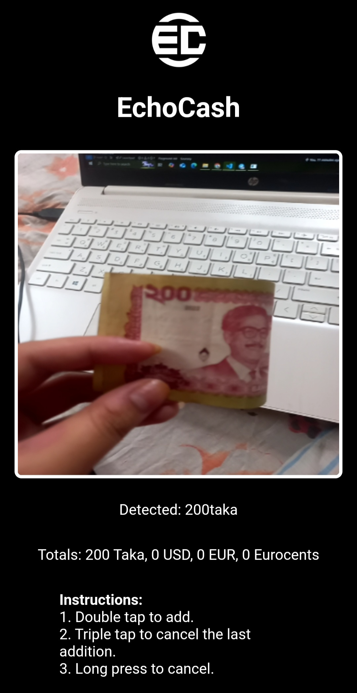

# EchoCash

  

EchoCash is a machine learning project designed to assist visually impaired people by detecting currency. It can recognize USD, EURO, and BDT. Trained using YOLO along with convolution layers, it achieves a precision of 98.61%.

### How to Use This Model

This project is designed to be used on a mobile phone with a laptop/computer acting as the local server.

#### Steps to Set Up:

1. **Download the Project**  
   Download the EchoCash project to your laptop/computer.

2. **Run ngrok.exe**  
   - Launch `ngrok.exe` on your laptop/computer.
   - Run the following command in your terminal:  
     `ngrok http 5000`

3. **Get Your ngrok URL**  
   - After running the command, ngrok will provide a URL. It will look something like:  
     `https://xxxxxxxx.ngrok-free.app`
   - Copy this URL.

4. **Update WebSocket Address**  
   - Open `static/script.js` on your laptop/computer.
   - Replace the existing WebSocket connection line:  
     `var socket = io.connect("wss://xxxxxxxx.ngrok-free.app");`  
     with the URL you got from ngrok (e.g., `wss://xxxxxxxx.ngrok-free.app`).

5. **Run the Server**  
   - Run the `server.py` file on your laptop/computer. This will start the backend server that handles object detection.

6. **Visit the URL on Your Phone**  
   - On your phone, open a browser and navigate to the ngrok URL you copied:  
     `https://xxxxxxxx.ngrok-free.app`

7. **Start Detecting!**  
   - The app should now be ready to detect currency! Point your phone camera at the currency, and the app will provide feedback.

#### Example Image

  

Enjoy using EchoCash and help visually impaired people easily detect currency!

